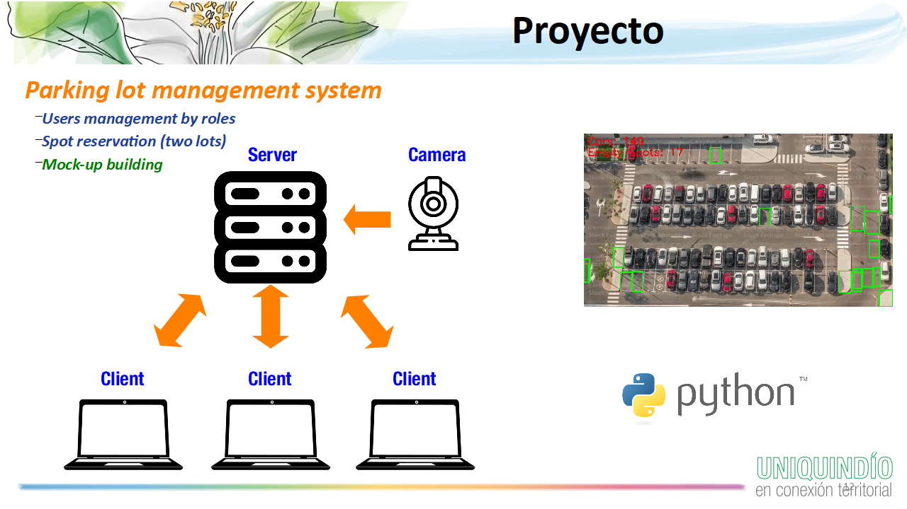

<h1 align="center">
Entrega: Servidor del Sistema de Administración de Parqueadero (RA 1, RA 3 y RA 4) <br />
 </h1>
 <p align="center">
Alexander López-Parrado, PhD. <br />
Programación, I-2025 <br />
GDSPROC <br />
Uniquindío <br />
</p>

Con esta práctica se iniciará el desarrollo del código fuente en Python del proyecto del espacio académico. En este caso, y de acuerdo a la arquitectura mostrada en la siguiente figura, se construirá el código del lado del servidor para la gestión de usuarios y de puestos de parqueadero.

<p align="center">

</p>
En ese sentido, esta parte del proyecto contempla la creación y prueba de funciones que hacen uso de archivos para la gestión de los usuarios y de los puestos de parqueadero, así como las demás estructuras de programación y tipos de datos estudiados hasta el momento. El control de acceso a los puestos de parqueadero será llevado a cabo mediante códigos QR.

## Código base suministrado

Se suministra el código base del servidor en el archivo [parking_server.py](parking_server.py) el cual contiene toda la funcionalidad para que éste opere dentro de una red de área local o en el mismo equipo de prueba. **Este archivo no debe ser modificado bajo ninguna circunstancia**.

En ese sentido, el archivo [parking_server.py](parking_server.py) usa el archivo [users.py](users.py) que incluye definiciones de funciones las cuales deben ser implementadas o complementadas como parte de esta entrega del proyecto de acuerdo a lo descrito en los comentarios del archivo. **La implementación de estas funciones y su correcto funcionamiento determina la evaluación del lado del servidor del proyecto**.

El servidor permite registrar usuarios con un número de identificación y una contraseña, y una vez un usuario esté registrado podrá:

* Solicitar un código QR que ser usado como medio de acceso al parqueadero.
* Enviar un código QR para determinar si existe un puesto de parqueadero disponible según el rol del usuario.

El código para la generación y encriptación de los códigos QR se incluye en el archivo [users.py](users.py), por lo que es importante que se analice y se comprenda su funcionamiento. Además, se debe incluir en el archivo [users.py](users.py) el algoritmo para detección de puestos de parqueadero elaborado en el lab1.

De otro lado, se suministran los archivos [parking_client.py](parking_client.py) y [test_parking_client.py](test_parking_client.py). En este caso, [parking_client.py](parking_client.py) implementa la funcionalidad básica de los usuarios para la conexión con el servidor por lo que **no debe ser modificado bajo ninguna circunstancia**. De otro lado, [test_parking_client.py](test_parking_client.py) es un archivo de prueba que se suministra para verificar el correcto funcionamiento del servidor y que puede ser modificado a gusto de los miembros del equipo. Para que [parking_client.py](parking_client.py) pueda funcionar correctamente se debe instalar el módulo de Python requests ejecutando el siguiente comando en una terminal:

``` pip install requests ```

También es necesario instalar módulos adicionales para el manejo de los códigos QR mediante los siguientes comandos:

```
pip install pycryptodome
pip install pyqrcode
pip install pypng
pip install pyzbar
pip install pillow
```

## ¿Cómo realizar las pruebas?

Para la realización de las pruebas debe ejecutar primero el programa [parking_server.py](parking_server.py), la recomendación es verificar el correcto funcionamiento de las funciones, una a la vez. Posteriormente se puede ejecutar el programa [test_parking_client.py](test_parking_client.py), en caso de que se creen ventanas emergentes de Windows solicitando permisos, por favor otorgarlos ya que los programas hacen uso de los servicios de red. 

Tenga en cuenta que es posible que [parking_server.py](parking_server.py) y [test_parking_client.py](test_parking_client.py) se ejecuten en computadores diferentes siempre y cuando los equipos se encuentren conectados a la misma red LAN cableada o inalámbrica. En ese caso basta con consultar la dirección IP del computador que está ejecutando [parking_server.py](parking_server.py) mediante el comando ipconfig como se muestra en la siguiente figura.


<p align="center">

</p>

La IP encontrada debe sustituir "localhost" en la línea 6 de [test_parking_client.py](https://github.com/parrado/lab2/blob/c80a0f73b9324b082ebea63a3377358d36a4c8d8/test_trivia_client.py#L6#L6)

# Entrega del laboratorio

El laboratorio debe ser presentado mediante:

1. Repositorio en GitHub.
2. Informe de laboratorio.

El informe de laboratorio y el enlace al repositorio de GitHub deben ser compartidos en el enlace dispuesto para tal fin en la plataforma Google Classroom.
